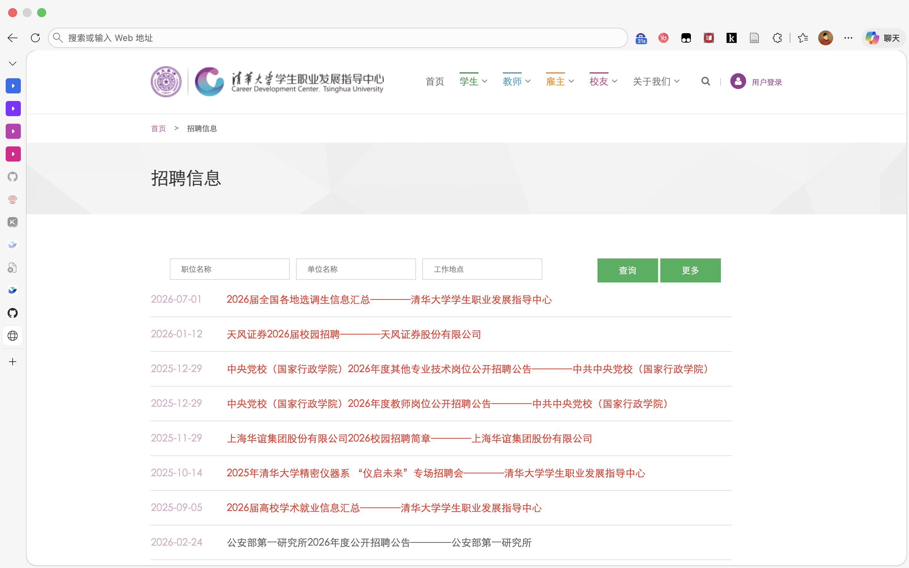

# thujob

爬取清华大学就业信息网的招聘信息，支持按日期范围筛选，并可导出为 JSON、Word 文档或 Excel 表格格式。
注意，本项目仅作个人学习和生活使用，请勿用于商业用途。
招聘信息官网为：https://career.cic.tsinghua.edu.cn/xsglxt/f/jyxt/anony/xxfb


## 功能特点

- 📅 **日期范围筛选**：支持按开始日期和结束日期筛选招聘信息
- 🔍 **详情页爬取**：可选获取每条招聘信息的详细内容
- 📄 **多种格式导出**：支持 JSON、Word 文档（.docx）和 Excel 表格（.xlsx）格式
- 🖥️ **交互式/命令行模式**：支持交互式向导和命令行参数两种使用方式
- ⏱️ **智能翻页**：自动处理翻页，支持限制最大爬取页数

## 安装依赖

```bash
pip install -r requirements.txt
```

## 使用方法

### 交互模式（推荐）

直接运行脚本，按提示输入参数：

```bash
python crawl_jobs.py
```

交互模式会引导你输入：
- 开始日期（默认今天）
- 结束日期（默认今天）
- 是否获取详情页内容
- 最大爬取页数（可选）
- 输出文件基础名（同时生成 .json / .docx / .xlsx 三种格式）

### 命令行模式

```bash
# 基本用法 - 爬取今天到今天的招聘信息
python crawl_jobs.py

# 指定日期范围
python crawl_jobs.py -s 2026-01-01 -e 2026-02-28

# 获取详情页内容（会增加爬取时间）
python crawl_jobs.py -s 2026-01-01 -e 2026-02-28 -f

# 限制爬取页数
python crawl_jobs.py -s 2026-01-01 -e 2026-02-28 -m 10

# 输出为 Word 文档
python crawl_jobs.py -s 2026-01-01 -e 2026-02-28 -f -o jobs.docx

# 输出为 JSON
python crawl_jobs.py -s 2026-01-01 -e 2026-02-28 -f -o jobs.json

# 输出为 Excel
python crawl_jobs.py -s 2026-01-01 -e 2026-02-28 -f -o jobs.xlsx
```

### 命令行参数

| 参数 | 简写 | 说明 |
|------|------|------|
| `--start-date` | `-s` | 开始日期 (格式: YYYY-MM-DD) |
| `--end-date` | `-e` | 结束日期 (格式: YYYY-MM-DD) |
| `--max-pages` | `-m` | 最大爬取页数 |
| `--output` | `-o` | 输出文件路径 (.json / .docx / .xlsx) |
| `--fetch-details` | `-f` | 获取详情页内容 |
| `--delay` | `-d` | 请求间隔秒数 (默认: 1) |
| `--cli` | `-c` | 强制使用命令行模式 |

## 输出格式

### JSON 格式

```json
[
  {
    "date": "2026-02-05",
    "url": "https://career.cic.tsinghua.edu.cn/...",
    "title": "职位标题",
    "company": "公司名称",
    "scope": "外",
    "is_highlighted": false,
    "detail": {
      "full_content": "详细信息完整内容..."
    }
  }
]
```

### Word 文档格式

包含格式化的招聘信息，每条信息包含：
- 职位标题
- 基本信息表格（日期、公司、发布范围、链接）
- 详细内容（如获取了详情页）

### Excel 表格格式

包含结构化的招聘信息表格，每行一条记录，包含以下列：
- 发布日期
- 职位标题
- 公司名称
- 发布范围
- 详情链接
- 详细内容（如获取了详情页）

适合用于数据筛选、排序和进一步处理。

### 例子

在 examples 里面，是2026-02-01 到 2026-02-25 的招聘信息。

openclaw修改这一行
